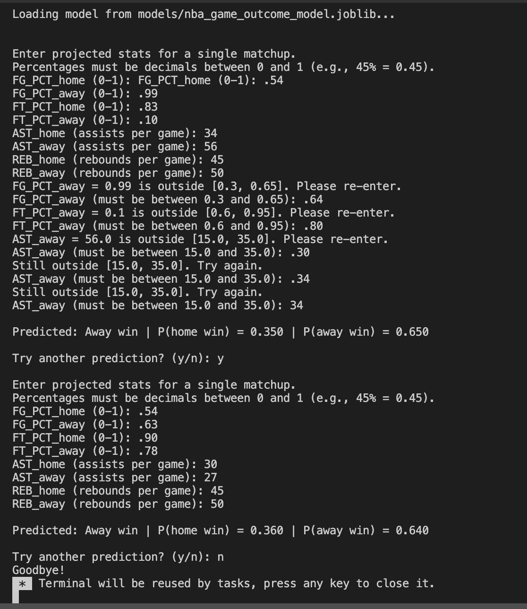
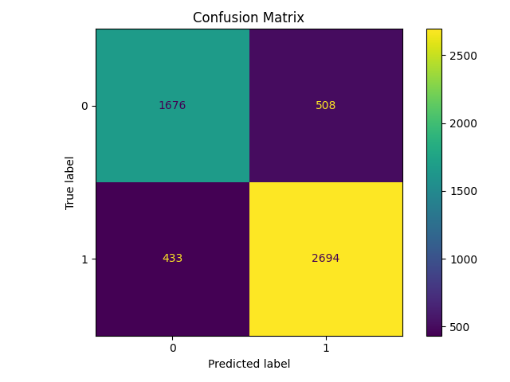

# 🏀 NBA Outcome Predictor

A machine learning project that predicts **NBA game outcomes** (home win vs. away win) from **pre-game team statistics**.  
Built using **Python, pandas, scikit-learn, and joblib**.

---

## Project Structure


```
nba-outcome-predictor/
├── src/
│ ├── train.py # trains the model, saves metrics + plot
│ └── Predict_New_Game.py # interactive predictor script
├── models/
│ └── nba_game_outcome_model.joblib
├── reports/
│ ├── metrics.json
│ └── figures/
│ ├── confusion_matrix.png
│ └── example_prediction.png
├── requirements.txt
├── .gitignore
└── README.md
```
---

## Setup

Clone the repository and install dependencies:


```bash
python3 -m venv venv
source venv/bin/activate        # Windows: venv\Scripts\activate
pip install -r requirements.txt
```
## Train the Model

```bash
python src/train.py
```
This script:
- Trains a RandomForestClassifier
- Saves the model to models/nba_game_outcome_model.joblib
- Writes metrics to reports/metrics.json
- Saves a confusion matrix to reports/figures/confusion_matrix.png

## Predict (interactive)

```bash
python src/Predict_New_Game.py
```
Enter FG%/FT% as decimals (e.g., 0.45 = 45%) and AST/REB as season-average floats.
Strict mode (enabled) asks you to re-enter values outside typical NBA ranges.

Example Prediction Run
Here’s what an interactive prediction looks like with strict mode on:



## Example Results
Evaluation metrics (from reports/metrics.json):

```json
{
  "accuracy": 0.82,
  "precision": 0.84,
  "recall": 0.86,
  "f1": 0.85,
  "roc_auc": 0.90
}
```
Confusion matrix (from reports/figures/confusion_matrix.png):

